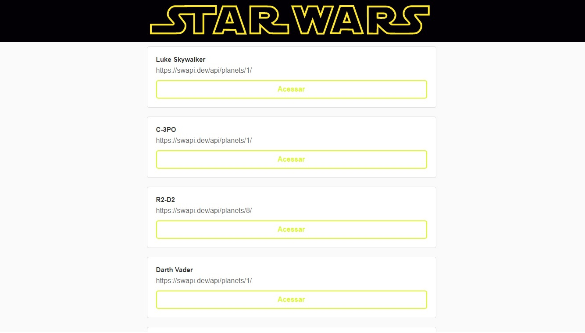
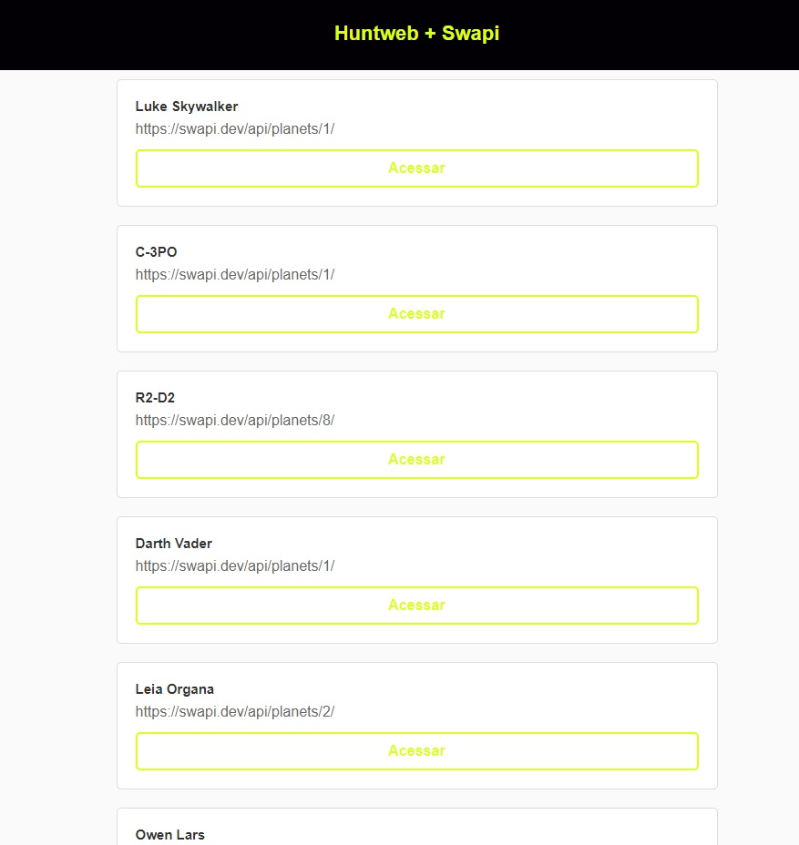
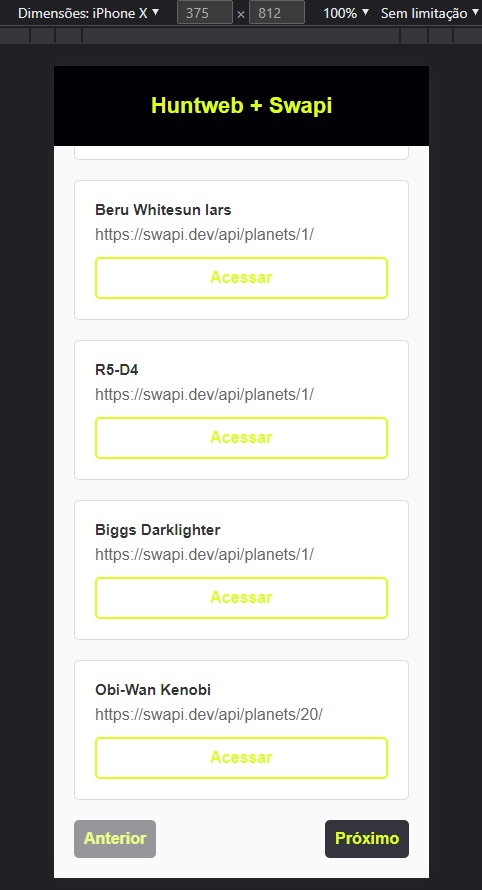
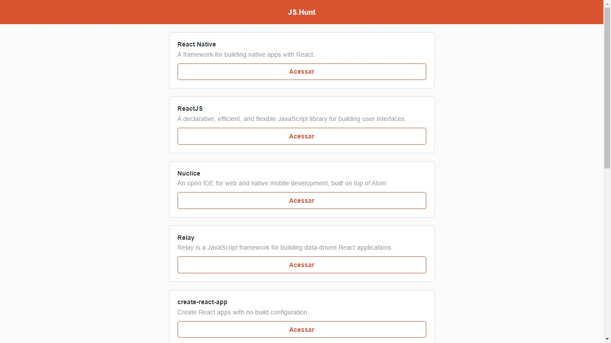

<h4 align="center"> 
	🚧 Huntweb Swapi 🚀
</h4>

<h1 align="center">
    
</h1>

## 💻 Sobre o projeto

Projeto para consumir informações do star wars da api swapi e exibir no frontend desenvolvido em reactjs. Permite acessar uma introdução de cada item ao clicá-lo.

#### Nova Api Swapi

- [swapi](https://swapi.dev/), [swapi infos](https://swapi.dev/about), [swapi documentation](https://swapi.dev/documentation) 
- `https://swapi.dev/api/`
- rotas das informações da swapi
````json
{
    "people": "https://swapi.dev/api/people/", 
    "films": "https://swapi.dev/api/films/", 
    "vehicles": "https://swapi.dev/api/vehicles/",
    "planets": "https://swapi.dev/api/planets/",  
    "species": "https://swapi.dev/api/species/", 
    "starships": "https://swapi.dev/api/starships/"
}
````
- utilizar informações no arquivo json: planets, species, starships

### 💻 Tópicos

A seguir, listei os tópicos abordados para construir o projeto original.

A versão atual do projeto sofreu algumas modificações no que implica a forma como estão sendo realizados os itens listadas.

#### 1. O que é ReactJS ?

- [x] 1.1. ReactJS construir o Frontend
- [x] 1.2. uma biblioteca para desenvolver em javascript
- [x] 1.3. Acessar API Rest
- [x] 1.4. Roteamento
- [x] 1.5. Componentes
- [x] 1.6. Estados e Propriedades

#### 2. Criando Projeto

- [x] 2.1. `node -v`
- [x] 2.2. `npm -v`
- [x] 2.3. `yarn -v`
- [x] 2.4. `create-react-app huntweb`
- [x] 2.5. `cd huntweb`
- [x] 2.6. `code .`
- [x] 2.7. `npm start`

#### 3. O que são componentes ?

- [x] 3.1. conceito de componentização
- [x] 3.2. react
- [x] 3.3. react-dom 
- [x] 3.4. método do componente: render

#### 4. Criando Header ?

- [x] 4.1. na pasta src, na pasta componentes, na pasta Header, então criar todos arquivos desse componente: index.js
- [x] 4.2. Estilização do component Header: styles.css
- [x] 4.3. Estilização global 

#### 5. Buscando produtos da API 

- [x] 5.1. acessar API Rest feita em nodejs e exibir na nossa tela em ReactJS.
- [x] 5.2. fiz essa api no repositório nodejs-api
- [x] 5.3.1. essa API Rest fornece o dados dos produtos: id, title, description, url, ( createdAt, não será exibido) 
- [x] 5.3.2. informações de paginação: docs, total, limit, page, pages
- [x] 5.4. biblioteca axios: `yarn add axios`: permite acessar um endereço externo: pasta services/api.js
- [x] 5.5. A URL da nossa API: `http://rocketseat-node.herokuapp.com/api`
- [x] 5.6. Insomnia: usar essa aplicação para gerir os dados da api
- [x] 5.7. Na api, os produtos estão dentro da informação `docs` 
- [x] 5.8. A busca dessas informações na api será realizada pelo main/index.js.

#### 6. Armazenamento no estado

- [x] 6.1. state, estado, acredito ser o principal conceito do reactjs
- [x] 6.2. o react trabalha com variável state e não variável normal. 
- [x] 6.3. o `estado` trabalha em manipular a variável objeto

#### 7. Listando produtos

- [x] 7.1. estilizar a exibição dos produtos

#### 8. Páginas anterior / próxima

- [x] 8.1. fazer a paginação dos produtos
- [x] 8.2. criar os botões: anterior e próximo
- [x] 8.3. estilização dos botões
- [x] 8.4. chamar um método toda vez que o usuário clicar no botão

#### 9. Configurando Navegação (Roteamento)

- [x] 9.1. Usar rotas para a navegação: `yarn add react-router-dom`
- [x] 9.2. Componente de detalhes dos produtos: browserrouter, switch, route 
- [x] 9.3. Redirecionar o usuário conforme cada rota
- [x] 9.4. Componente Link para cada um dos botões

#### 10. Navegando para o detalhe

- [x] 10.1. Buscar os dados dos produtos da API Rest
- [x] 10.2. Exibir em tela na pages products
- [x] 10.3.1. state
- [x] 10.3.2. async await
- [x] 10.3.3. props 
- [x] 10.3.4. componentdidmount
- [x] 10.4. Estilização da product info

---

### Próximo passo para frontend

- [ ] 1. responsividade
- [ ] 2. acessibilidade
- [ ] 3. modo dark / light
- [ ] 4. variação de cores
- [ ] 5. hospedar aplicação

---

#### Encerramos 

Componentização, roteamento, ciclos de vida, utilização de API Rest, estado. 

## 🎨 Layout

Uma aplicação web que requisita informações de uma API

### Web - v2.0

- [x] favicon da star wars: insirido as imagens na pasta public
- [x] fluxo da rota
- [x] componente de loader para o elemento people clicado
- [x] paginação de objetos
- [x] estilização de item clicado
- [x] header fixed
- [x] header logo
- [ ] tratar paginação no fluxo para page > 1 (Navegação (Roteamento))
- [ ] o botão voltar (Navegação (Roteamento))
- [x] [reactrouter](https://v5.reactrouter.com/web/guides/quick-start)
- [x] inspiração [starwars-visualguide](https://starwars-visualguide.com/#/)
- [x] inspiração [tbone849-star-wars-guide](https://github.com/tbone849/star-wars-guide)
- [x] inspiração [swapi-task](https://finmavis.github.io/swapi-task/)
- [x] inspiração [finmavis-swapi-task](https://github.com/finmavis/swapi-task)
- [x] inspiração [animatk-ReactJS-Star-Wars-API](https://github.com/animatk/ReactJS-Star-Wars-API)

<h5 align="center"> 
	🚀 mudança da api para `https://swapi.dev.api`
</h5>

<p align="center" style="display: flex; align-items: flex-start; justify-content: center;">
  
  
  
</p>

### Web - v1.0

<h5 align="center"> 
	🚀 mudança da api para `http://rocketseat-node.herokuapp.com/api`
</h5>

<p align="center" style="display: flex; align-items: flex-start; justify-content: center;">
  
</p> 

## 🛠 Tecnologias

As seguintes ferramentas foram usadas na construção do projeto:

- [Css][css]: posicionamento, dimensionamento e muito mais
- [Javascript][javascript]
- [HTML][html]: estrutura e efeitos 
- [React][reactjs]: os fundamentos, como state, props, components, ciclo de vida.
- [Git][git]
- [Github][github] 
- [Yarn][yarn]
- [Node.js][nodejs]
- [Zeit Now](https://vercel.com/) 

## 🚀 Como executar o projeto

Podemos considerar este projeto como sendo com uma parte:
1. Front End 
2. API Rest

### Pré-requisitos

Antes de começar, você vai precisar ter instalado em sua máquina as seguintes ferramentas:
[Git](https://git-scm.com), [Node.js][nodejs]. 
Além disto é bom ter um editor para trabalhar com o código como [VSCode][vscode]

### 🧭 Rodando a aplicação web (Front End)

```bash 
# Clone este repositório
$ git clone https://github.com/douglasabnovato/huntweb

# Acesse a pasta do projeto no seu terminal/cmd
$ cd huntweb 

# Instale as dependências
$ npm install

# Execute a aplicação em modo de desenvolvimento
$ npm run start

# A aplicação será aberta na porta:3000 - acesse http://localhost:3000

```

## 😯 Como contribuir para o projeto

1. Faça um **fork** do projeto.
2. Crie uma nova branch com as suas alterações: `git checkout -b my-feature`
3. Salve as alterações e crie uma mensagem de commit contando o que você fez: `git commit -m "feature: My new feature"`
4. Envie as suas alterações: `git push origin my-feature`
> Caso tenha alguma dúvida confira este [guia de como contribuir no GitHub](https://github.com/firstcontributions/first-contributions)

## 📝 Licença

Este projeto esta sobe a licença MIT.

Feito com ❤️ por Douglas A B Novato 👋🏽 [Entre em contato!](https://www.linkedin.com/in/douglasabnovato/)

[git]: https://git-scm.com/doc
[github]: https://docs.github.com/en
[nodejs]: https://nodejs.org/
[reactjs]: https://reactjs.org
[yarn]: https://yarnpkg.com/
[vscode]: https://code.visualstudio.com/
[css]: https://developer.mozilla.org/en-US/docs/Web/CSS 
[html]: https://developer.mozilla.org/en-US/docs/Web/HTML
[javascript]: https://developer.mozilla.org/en-US/docs/Web/JavaScript 
